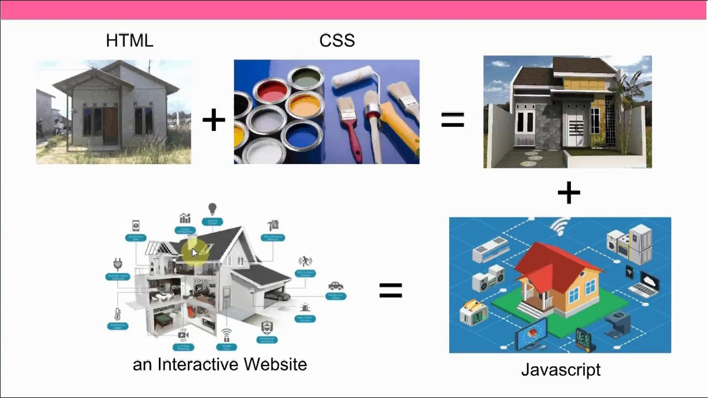

import { Appear, Embed, Notes } from "mdx-deck";
import { CodeSurferLayout } from "code-surfer";


## <a>Introduction</a> to web development 👨‍💻

---


---

<CodeSurferLayout>

```markup title="Apa yang membentuk sebuah website 💻"
```

```markup title="Apa yang membentuk sebuah website 💻" subtitle="HTML"
├─ Struktur
```

```markup 1:2 title="Apa yang membentuk sebuah website 💻" subtitle="CSS"
├─ Struktur
├─ Tampilan
```

```markup 1:3 title="Apa yang membentuk sebuah website 💻" subtitle="Javascript"
├─ Struktur
├─ Tampilan
└─ Interaksi
```

```js 1:3 title="Apa yang membentuk sebuah website 💻" subtitle="❤"
let website = Struktur + Tampilan + Interaksi
```

</CodeSurferLayout>

---

### kita <a>Ibaratkan</a> website <u>adalah</u> sebuah rumah 🏡

---



---

### website ❤ = HTML + CSS + Javascript