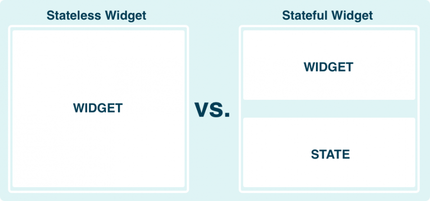
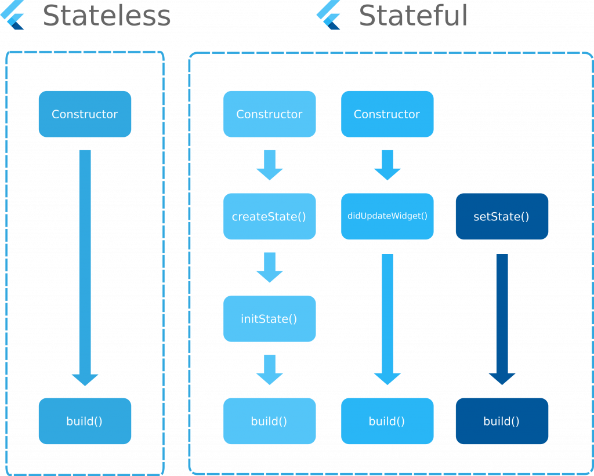

import { Appear, Embed, Notes } from "mdx-deck";
import { CodeSurferLayout } from "code-surfer";


## Let`s Start With <a>Flutter Widgets</a> 👨‍💻

---

<CodeSurferLayout>

```js title="Whats is Flutter Widget ?"
class Car { // blueprint
    // property
    String brand;
    int year;
    int price;

    // method
    int getAge(int currentYear) {
        return currentYear - this.year;
    }
}
```

```js title="Whats is Flutter Widget ?"
1.  Class dan Method siap pakai untuk membuat tampilan UI
```

```js title="Whats is Flutter Widget ?"
1.  Class dan Method siap pakai untuk membuat tampilan UI

    Karna berbentuk class, 
    Widget bisa lagsung digunakan.
```

```js title="Whats is Flutter Widget ?"
1.  Class dan Method siap pakai untuk membuat tampilan UI

    Karna berbentuk class, 
    Widget bisa lagsung digunakan.
    Atau dirangakai menjadi sesuatu yang baru
```

```js 1:3 title="Whats is Flutter Widget ?"
void main() {
  
}
```

```js 1:5 title="Whats is Flutter Widget ?"
import 'package:flutter/material.dart';

void main() {
  
}
```


```js 1:12 title="Whats is Flutter Widget ?"
import 'package:flutter/material.dart';

void main() {
   runApp(
    Center(
      child: Text(
        'Hello, world!',
        textDirection: TextDirection.ltr,
      ),
    ),
  );
}
```

</CodeSurferLayout>

---


---

<CodeSurferLayout>

```js title="Whats is Flutter Widget ?"
1.  Class dan Method siap pakai untuk membuat tampilan UI

    Karna berbentuk class, 
    Widget bisa lagsung digunakan.
    Atau dirangakai menjadi sesuatu yang baru
```

```js title="Whats is Flutter Widget ?"
1.  Class dan Method siap pakai untuk membuat tampilan UI

    Karna berbentuk class, 
    Widget bisa lagsung digunakan.
    Atau dirangakai menjadi sesuatu yang baru

2.  Terinfluence dari React js di Javascript
```

```js title="Whats is Flutter Widget ?"
1.  Class dan Method siap pakai untuk membuat tampilan UI

    Karna berbentuk class, 
    Widget bisa lagsung digunakan.
    Atau dirangakai menjadi sesuatu yang baru

2.  Terinfluence dari React js di Javascript

    Seperti Component pada React js, Widget Punya 2 Type
```

```js title="Whats is Flutter Widget ?"
1.  Class dan Method siap pakai untuk membuat tampilan UI

    Karna berbentuk class, 
    Widget bisa lagsung digunakan.
    Atau dirangakai menjadi sesuatu yang baru

2.  Terinfluence dari React js di Javascript

    Seperti Component pada React js, Widget Punya 2 Type
    1. Stateful Widget
```

```js title="Whats is Flutter Widget ?"
1.  Class dan Method siap pakai untuk membuat tampilan UI

    Karna berbentuk class, 
    Widget bisa lagsung digunakan.
    Atau dirangakai menjadi sesuatu yang baru

2.  Terinfluence dari React js di Javascript

    Seperti Component pada React js, Widget Punya 2 Type
    1. Stateful Widget
    2. Stateless Widget
```
</CodeSurferLayout>

---



---



---

<CodeSurferLayout>

```js title="Stateful vs Stateless ?"
class HomeScreen {

}
```

```js 1:3 title="Stateful vs Stateless ?"
class HomeScreen extends StatelessWidgets {

}
```


```js 1:8 title="Stateful vs Stateless ?"
class HomeScreen extends StatelessWidgets {
    @override
    Widget build(BuildContext context) {
        return Container(
            // implement UI Screen
        )
    }
}
```

```js 1:13 title="Stateful vs Stateless ?"
class HomeScreen extends StatefulWidget {
    @override
    _HomeScreenState createState() => _HomeScreenState();
}

class _HomeScreenState extends State<HomeScreen> {
    @override
    Widget build(BuildContext context) {
        return Container(
            // implement UI Screen
        )
    }
}
```


```js 1:16 title="Stateful vs Stateless ?"
class HomeScreen extends StatefulWidget {
    @override
    _HomeScreenState createState() => _HomeScreenState();
}

class _HomeScreenState extends State<HomeScreen> {
    String username = 'bayu';
    String status = 'penguna baru';

    @override
    Widget build(BuildContext context) {
        return Container(
            // implement UI Screen
        )
    }
}
```

</CodeSurferLayout>

