import { Appear, Embed, Notes } from "mdx-deck";
import { CodeSurferLayout } from "code-surfer";

# <a>&lt;p&gt;</a> itu apa ya ? 🤔
<hr />

<Appear>
    <h3>itu adalah <a>Tag</a> dalam HTML 🎉🎉</h3>
</Appear>

---

# <a>Tag</a> & <a>Content</a>

---

<div style={{display: "flex"}}>
    <div>
        
    </div>
    <div>
        <ul>
        <Appear>
            <li><b>Open Tag</b></li>
            <li><b>Closing Tag</b></li>
            <li><b>Content</b></li>
            <li><b>Element/Tag Name</b></li>
        </Appear>
        </ul>
    </div>
</div>

---

<CodeSurferLayout>

```html title="Tag & Content" subtitle="Whats is?"
Tag =
Content =
Element/Tag Name =
```

```html title="Tag & Content" subtitle="Whats is?"
Tag = sebuah penanda markup
        <p></p>
Content =
Element/Tag Name =
```

```html title="Tag & Content" subtitle="Whats is?"
Tag = sebuah penanda markup
        <p></p>
Content = data (baik berupa teks maupun lainnya) yang ingin di tandai
        <p>Content</p>
Element/Tag Name =
```

```html title="Tag & Content" subtitle="Ada yang masih bingung ?"
Tag = sebuah penanda markup
        <p></p>
Content = data (baik berupa teks maupun lainnya) yang ingin di tandai
        <p>Content</p>
Element name = Maksud dari penanda
        <p></p> (p merupakan Element name)
```

</CodeSurferLayout>

---

## <a>Aturan</a> dari tag dan content

---

#### 1. Sebagian besar tag, <a>berpasangan</a>

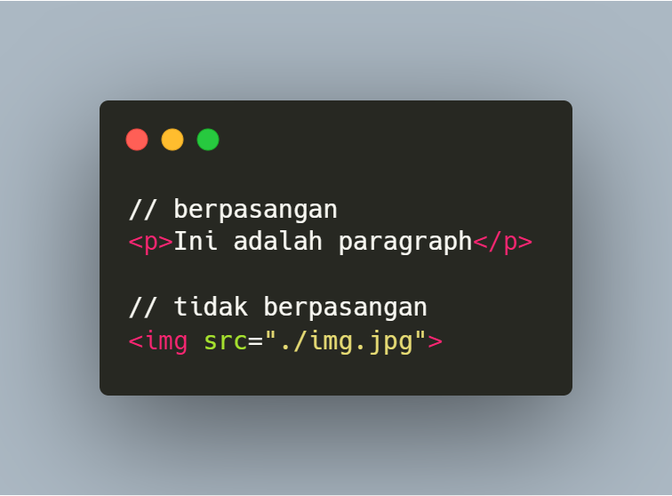

---

#### 2. Tag <a>selalu</a> dikelilingi oleh kurung sudut


---

#### 3. Tag penutup selalu dimulai dengan <a>garis miring "/"</a>

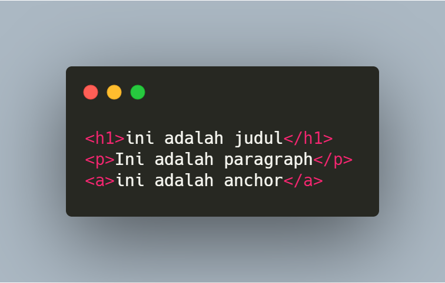

---

#### 4. Tutup bagian tag <a>paling dalam</a>


---

### Ini adalah 4 Aturan, tag dan content :

<ol>
    <li>
        Sebagian besar tag, <a>berpasangan</a>
    </li>
    <li>
        Tag <a>selalu</a> dikelilingi oleh kurung sudut
    </li>
    <li>
        Tag penutup selalu dimulai dengan <a>garis miring "/"</a>
    </li>
    <li>
        Tutup bagian tag <a>paling dalam</a>
    </li>
</ol>

---

### <a>Mari mengenal</a> tag yang sering kita pakai

---

### // Heading & Paragraph

+ <a>&lt;h1&gt; &lt;/h1&gt;</a>  Heading 1-6
+ <a>&lt;p&gt; &lt;/p&gt;</a> Paragraph
+ <a>&lt;button&gt; &lt;/button&gt;</a> Button

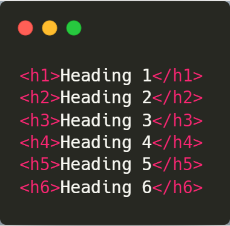


---

### // Font style

+ <a>&lt;b&gt; &lt;/b&gt;</a> <b>Bold</b>
+ <a>&lt;i&gt; &lt;/i&gt;</a> <i>Italic</i>
+ <a>&lt;u&gt; &lt;/u&gt;</a> <u>Underline</u>

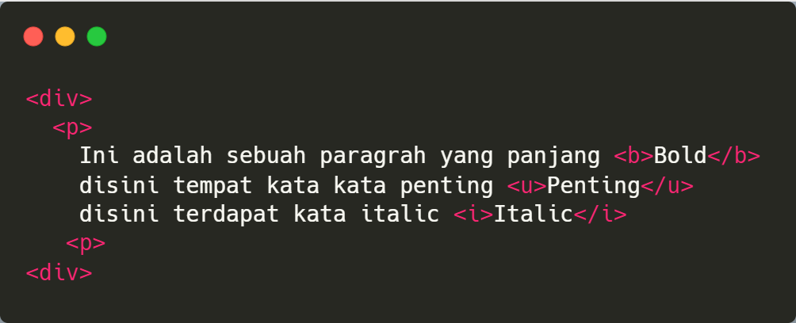

---

### // Line

+ <a>&lt;br&gt;</a> New line
+ <a>&lt;hr&gt;</a> New line with Border buttom

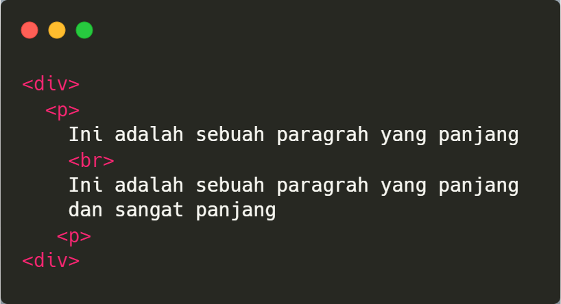


---
### // Lists

+ <a>&lt;ul&gt; &lt;/ul&gt;</a> Unordered list (+)
+ <a>&lt;ol&gt; &lt;/ol&gt;</a> Ordered list (Number)
+ <a>&lt;li&gt; &lt;/li&gt;</a> List 

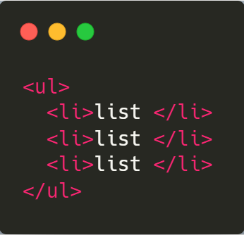

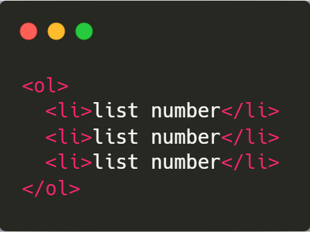

---

### // Divisions

+ <a>&lt;div&gt; &lt;/div&gt;</a> Divisions
+ <a>&lt;span&gt; &lt;/span&gt;</a> span/Menjangkau (text)

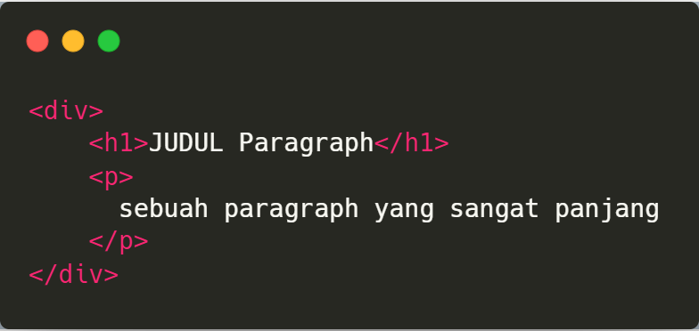

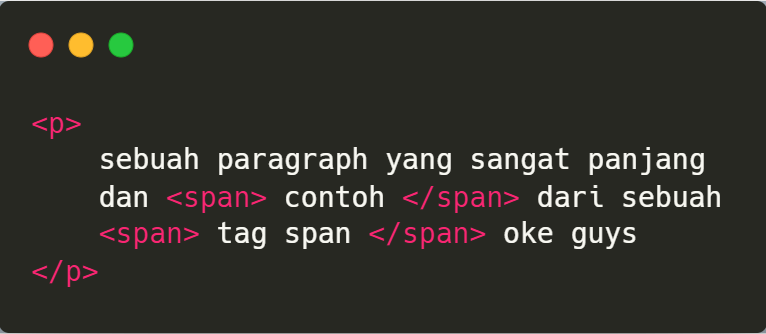

---

### // Harus disertakan attribute

+ <a>&lt;a&gt; &lt;/a&gt;</a> Divisions
+ <a>&lt;link&gt; &lt;/link&gt;</a> span/Menjangkau (text)
+ <a>&lt;img&gt;</a> Image
+ <a>&lt;script&gt; &lt;/script&gt;</a> Script


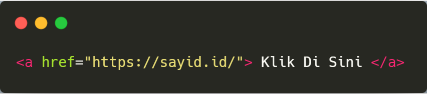


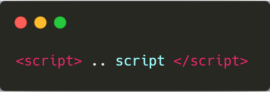

---

### Ada pertanyaan 🤔? 