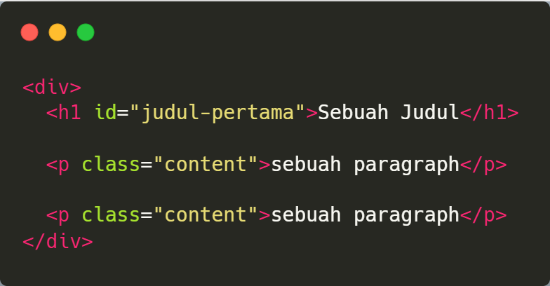
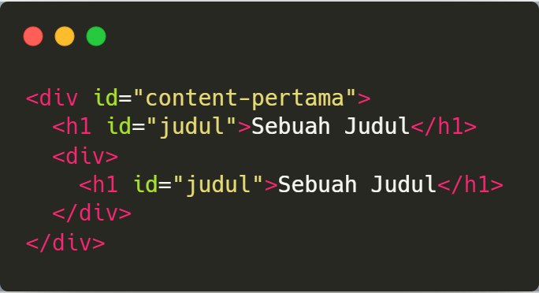
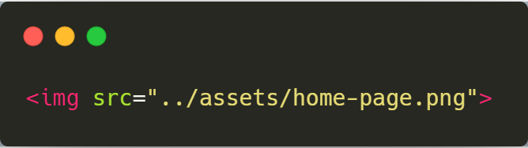
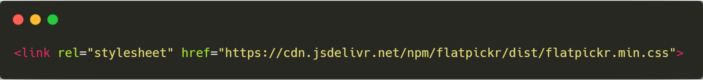
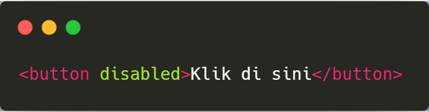
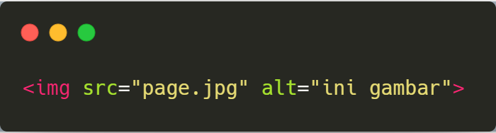

import { Appear, Embed, Notes } from "mdx-deck";
import { CodeSurferLayout } from "code-surfer";

### Mari kita lanjutkan, mari lihat <a>tag html</a> di bawah:

```html
1. 

2. <div class="navbar"></div>

3. <div id="post-content"></div>
```

---

### Pasti <a>muncul pertanyaan</a> gini?

<ol>
    <Appear>
        <li>
            apa itu yang ada di dalam tag <a>selain element name</a>?
        </li>
        <li>
            apa maksud dari &lt;div <a>id="post-content"</a> &gt; 🤔?
        </li>
    </Appear>
</ol>

---

## <a>Attrubute</a> & <a>value</a>

---

<CodeSurferLayout>

```html title="Attrubute & value" subtitle=""
Attrubute = property yang membantu mendefinisikan karakteristik tambahan
    
            <h1>Ini adalah sebuah judul</h1>
```

```html title="Attrubute & value" 
Attrubute = property yang membantu mendefinisikan karakteristik tambahan
    
            <h1 style="color: red">Ini adalah sebuah judul</h1>
```

```html title="Attrubute & value" 
Attrubute = property yang membantu mendefinisikan karakteristik tambahan
    
            <h1 style="color: red">Ini adalah sebuah judul</h1>

Value = nilai dari property, "color: red" adalah sebuah value 
```

</CodeSurferLayout>

---

### Aturan dari <a>Attrubute</a> & <a>value</a>

<ol>
    <Appear>
        <li>
            Atribute terpasang di <a>Tag pembuka</a>
        </li>
        <li>
            Atribute sudah di <a>tentukan oleh html</a>
        </li>
        <li>
            value harus di simpan di <a>antara tanda petik</a>
        </li>
        <li>
            Ada Attrubute yang sifatnya <a>global</a> dan <a>khusus*</a>
        </li>
    </Appear>
</ol>

---

### Atribute yang akan sering kita pakai

+ id // <a>Identitas unik sebuah element</a>
+ class // <a>Klasifikasi sebuah element</a>





---

### Atribute yang akan sering kita pakai

+ href // <a>(hypertext reference) menambahkan referensi</a>
+ src // <a>(source) menambahkan source</a>
+ rel // <a>(relationship) type document</a>





---

### Atribute yang akan sering kita pakai

+ alt // <a>alternative text for an image</a>
+ disabled // <a>disabled element</a>
+ style // <a>Inline CSS style for an element....> </a>




